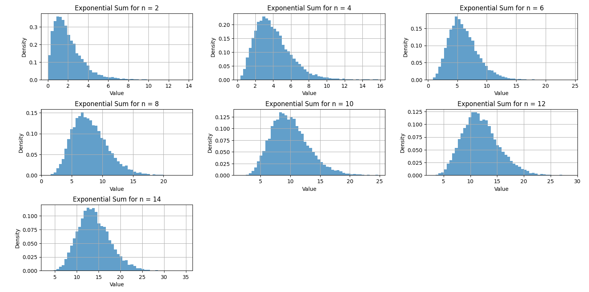
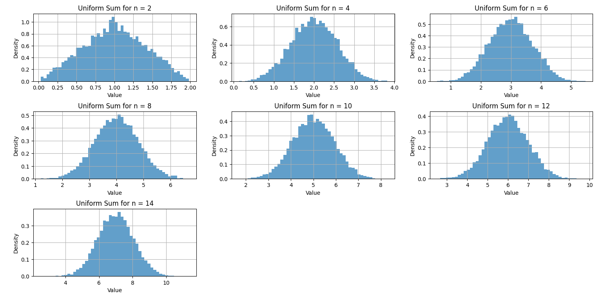

# 🔄 Sum of Random Variables – Engineering Probability Project (Q2)

This simulation explores how the sum of multiple **independent and identically distributed (i.i.d)** random variables evolves as the number of terms increases. It compares the behavior for two base distributions:

1. **Exponential Distribution** with rate parameter \( \lambda = 1 \)
2. **Uniform Distribution** on the interval [0, 1]

---

## 🧠 Objective

Demonstrate how the sum of i.i.d variables gradually approaches a **normal distribution**, in line with the **Central Limit Theorem (CLT)**.

---

## 🧮 Parameters

- \( n \in \{2, 4, 6, 8, 10, 12, 14\} \)
- Sample size = 10,000
- Exponential Distribution:
    f(x) = λ × exp(–λx)

- Uniform Distribution:
    f(x) = 1      when 0 ≤ x ≤ 1  &  f(x) = 0      otherwise

---

## 📊 Output

The following histograms show the probability density of the sum of `n` random variables:

### 🔹 Exponential Distribution


### 🔹 Uniform Distribution


---

## ▶️ How to Run

```bash
pip install matplotlib numpy scipy
python sum_distributions.py
