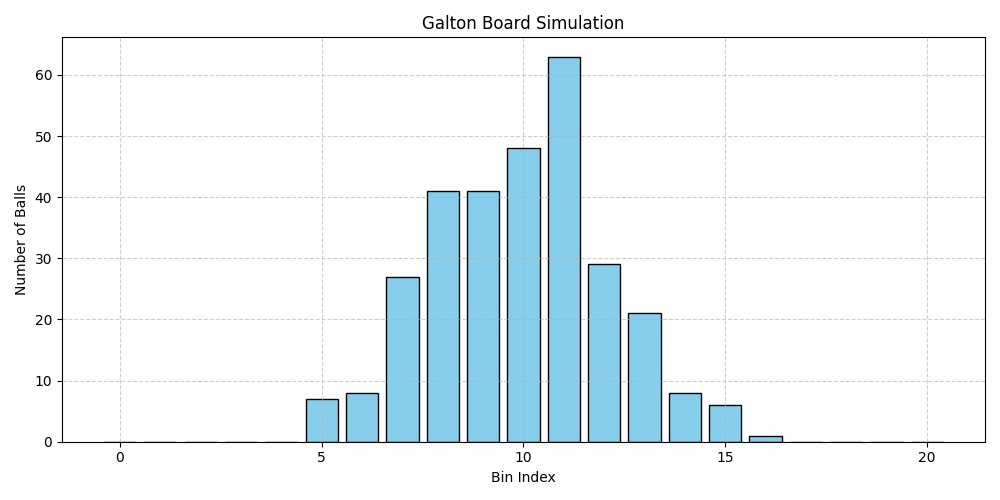
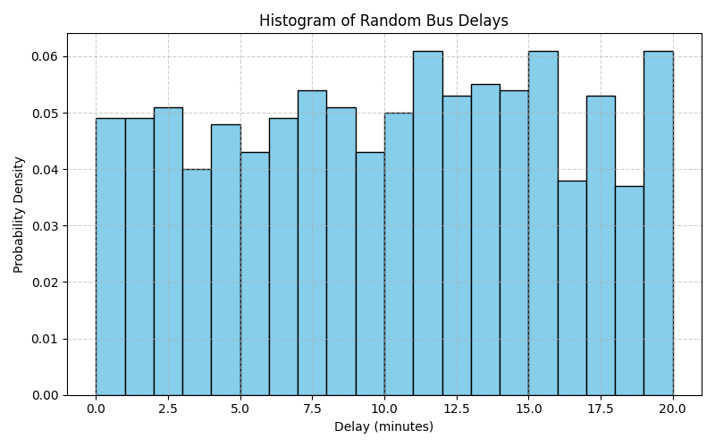

## 📘 Engineering Probability Projects – K. N. Toosi University of Technology

This repository contains a series of educational mini-projects implemented in Python as part of the **Engineering Probability** course (Winter 2023), under the supervision of **Dr. Bahareh Akhbari**. These simulations were used to support student learning, and I contributed as a **TA (Teaching Assistant)** in designing and coding these exercises.

---

## ✅ Project List

### 🔹 Q1 – Galton Board Simulation

Simulates a Galton board using random left/right decisions to show how the **binomial distribution** approximates the **normal distribution**.

📎 Example Output (resized preview):

---

### 🔹 Q2 – Sum of Random Variables

Visualizes how the sum of i.i.d. random variables from **exponential** and **uniform** distributions evolves toward a **normal shape**, demonstrating the **Central Limit Theorem**.

📎 Exponential Sum (resized): 

📎 Uniform Sum (resized):

---

### 🔹 Q3 – Bus Delay Simulation

Models a simple real-world scenario using a **uniform distribution** to simulate bus delays and calculate probabilities of waiting, with histogram analysis.

📎 Delay Histogram (resized):

---

## 🛠 Tools & Libraries Used

* Python 3.x
* numpy
* matplotlib
* scipy.stats

---

## 📄 Documentation

Project questions and translated descriptions are available in the `docs/` folder.
📎 `Engineering_Probability_Project_Translated.docx`

---

## 👨‍🏫 Instructor

**Dr. Bahareh Akhbari**
Department of Electrical Engineering
K. N. Toosi University of Technology

---

## 👨‍💻 Contributor

**Aliakbar Mohsennejad**
Undergraduate Student & Teaching Assistant
Electrical Engineering – Digital Systems

---

## 📚 Tags

`engineering-probability` `python-simulation` `ta-projects` `kntu` `undergraduate` `probability-distributions` `data-visualization`

---
